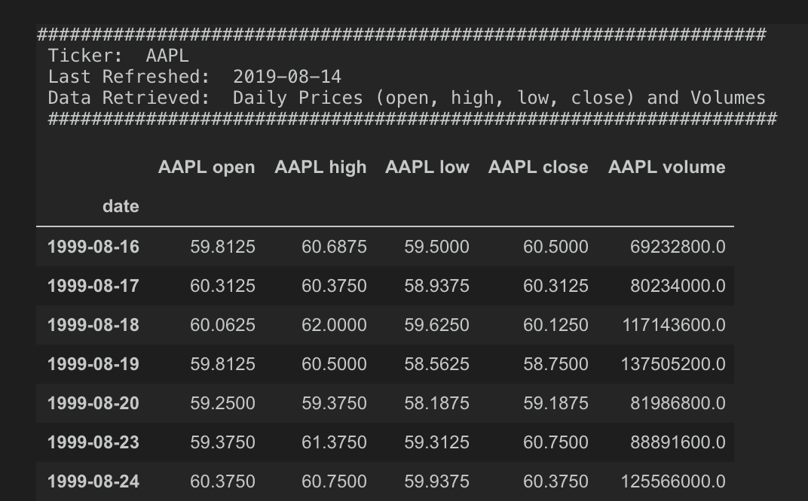
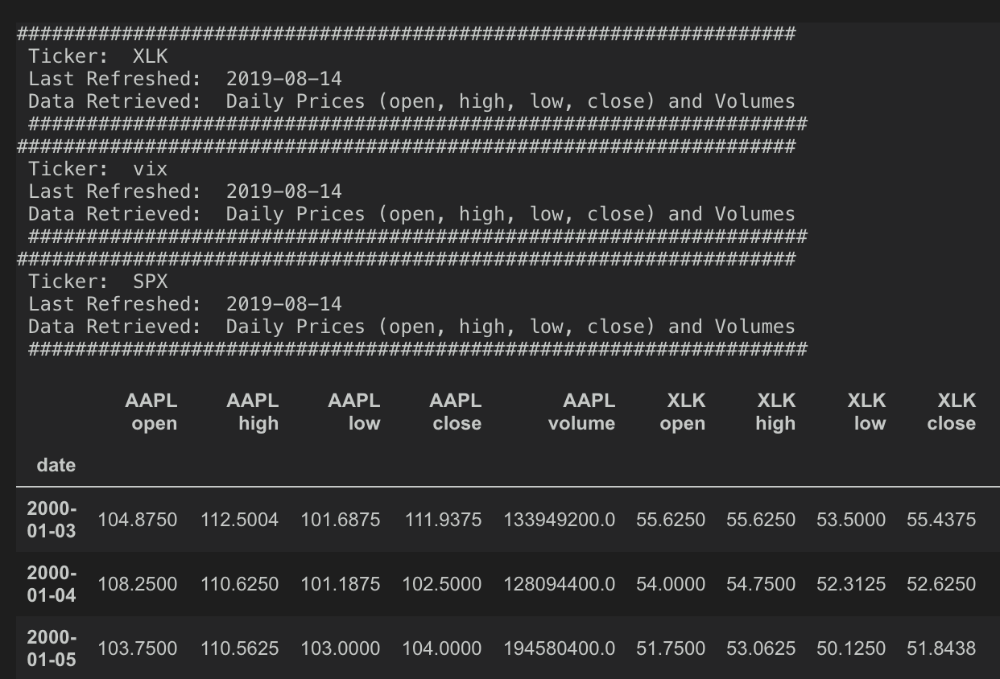

# Generating Daily Time Series With `fin_data`

The purpose of fin_data is to provide a simple yet flexible method for generating financial time series for the Investment Risk Analysis project for Lambda Labs. It relies on a series of API calls to create a data pipeline for model training.

Table of Contents
-----------

- [Getting Started](#Getting-Started)
    - [Development Environment](#Development-Environment)
    - [Environment Variables and Secrets](#Environment-Variables-and-Secrets)
    - [Create a DataFrame](#Create-a-DataFrame)
- [Additional Methods](#Additional-Methods)  
    - [add_securities()](#add_securities)  
    - [add_technicals()](#add_technicals)  
    - [add_forex()](#add_forex)  
    - [add_treasury_bonds()](#add_treasury_bonds)

## Getting Started

### Development Environment

There are several libraries that are necessary to use fin_data. Once modeling commences, a conda `environment.yml` will be established and maintained. Until then, here are the libraries that are necessary to run fin_data:

    alpha_vantage
    quandl
    python-decouple
    pandas
    numpy

### Environment Variables and Secrets

The API keys should be contained in a `.env` file located in the same directory. The directory should also contain a .gitignore. These environment variables are then referenced using the `python decouple` module. To install the modele, run the following command in a your terminal.

    pip install python-decouple

**Do not commit the API keys to github!!!**.

Example .env file:

    #Environment variable assignments`

    INTRINIO_KEY = "api_key_here"
    ALPHA_VANTAGE = "api_key_here"
    QUANDL_KEY = "api_key_here"

### Create a DataFrame

To begin, import the DailyTimeSeries class from the fin_data.py file:  

    from fin_data import DailyTimeSeries

From there you need to create the class object. The class object is used to store a number of attributes necessary for the data acquisition methods. To create the class object, you need to provide a security symbol as a parameter.

    apple = DailyTimeSeries('AAPL')

This example object will focus on Apple, so that when you call other fundamnetals or technical indicators, that attribute will be included. From there, call the `initiate()` method. This will return a dataframe based on available pricing for the company referenced when creating the class object.

    df = apple.initiate()

From here, you can judiciously add other financial information to your dataframe.

## Additional Methods

These methods are the meat of fin_data. It ingests data from API calls and merges them to the given dataframe with an inner merge on the datetime index. In cases where the new data is relatively sparse, it may significantly reduce the total amount of data in the dataset. **Some methods are still in development.**

### add_securities()

Adds price history from a list of securities and merges that data with
the existing dataframe. Only accepts a list of securities. Requires two parameters, **list of security tickers** and a **Pandas DataFrame to merge newly acquired data to.**

    new_symbols = ['XLK', 'vix', 'SPX']

    df = apple.add_securities(symbols=new_symbols,
                              primary_df=df)

### add_technicals()

Adds technical indicators from a list of securities and merges that data with the existing dataframe. Only accepts a list of technical indicators. Only accepts a list of technical indicators. Requires two parameters, **list of technical indicators** and a **Pandas DataFrame to merge newly acquired data to.** Allows an additional parameter supp_symbol. This refers to a supplimentary security symbol that provides the user with flexibility as to which company or index the technical indicator is being analyzed. This symbol must be a recognized security symbol.

    techs = ['midpoint', 'mama', 'mfi', 'sma']

    df = apple.add_technicals(tech_symbols=techs,
                              primary_df=df)

_**TODO:** Add Technical Indicators Table_

### add_forex()

Not functioning

### add_treasury_bonds()

Adds US treasury Bond interest rates to the dataset. Contains a wide-swath of available and unavailable bonds. Several features contain a large number of null values. Will warn about those null values in the print statement. Requires one parameter; a **Pandas DataFrame to merge newly acquired data to.**

Not functioning
